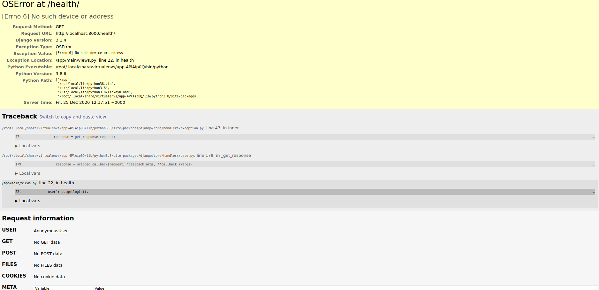

# 1) Створюю Dockerfile з наступним вмістом
    FROM python:3.8-slim
    
    LABEL author="Bohdan"
    LABEL version=1.0
    
    RUN apt-get update && apt-get upgrade -y
    
    RUN apt-get install git -y && pip install pipenv
    
    WORKDIR /lab
    
    RUN git clone https://github.com/brunoauditore/NULP_IK31_Fedoryshyn.git
    
    WORKDIR /app
    RUN cp -r /lab/NULP_IK31_Fedoryshyn/Laba3/* .
    
    RUN pipenv install
    
    EXPOSE 8000
        
    ENTRYPOINT ["pipenv", "run", "python", "manage.py", "runserver", "0.0.0.0:8000"]    
    
# 2) Створюю репозиторій на DockerHub
- https://hub.docker.com/r/brunoauditore/lab4

# 3) Створюю docker контейнер та зидваю його в репозиторій
    docker build -t brunoauditore/lab4:django .
    docker images
    dokcer push brunoauditore/lab4:django
    
# 4) Запускаю Docker контейнер 
    docker run -it --name=django --rm -p 8000:8000 brunoauditore/lab4:django
    

# 5) Створюю ще один Dockerfile з розширеннямм .site
    FROM python:3.8-slim
    
    LABEL author="Bohdan"
    LABEL version=2.0
    
    # оновлюємо систему
    RUN apt-get update && apt-get upgrade -y
    
    # Встановлюємо потрібні пакети
    RUN apt-get install git -y && pip install pipenv
    
    # Створюємо робочу папку
    WORKDIR /lab
    
    # Завантажуємо файли з Git
    RUN git clone https://github.com/brunoauditore/NULP_IK31_Fedoryshyn.git
    
    # Створюємо остаточну робочу папку з Веб-сайтом та копіюємо туди файли
    WORKDIR /app
    RUN cp -r /lab/NULP_IK31_Fedoryshyn/Laba3/* .
    
    # Інсталюємо всі залежності
    RUN pipenv install
    
    # Відкриваємо порт 8000 на зовні
    EXPOSE 8000
        
    # Це команда яка виконається при створенні контейнера
    ENTRYPOINT ["pipenv", "run", "python", "monitoring.py"]    
    
# 6) Створюю docker контейнер для моніторингу 
    docker build -f Dockerfile.site -t brunoaudiotre/lab4:monitoring .
    docker images
    dokcer push brunoauditore/lab4:monitoring
    
# 7) Запускаю моніторинг sudo docker run brunoauditore/lab4:monitoring
