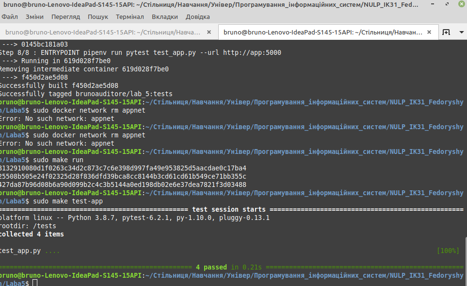

### 1) Створюю середовище 
    pipenv --python 3.8
    pipenv install -r requirements.txt
    
### 2) Запускаю Redis сервер
    sudo docker run --rm --net=host -it -p 6379 redis
    
### 3) Запукаю app.py 
    pipenv run python app.py
    
### 4) Заупускаю тести 
    pipenv run pytest test_app.py --url http://localhost:5000
### 4 passed

# Makefile

    sudo make app tests
    sudo docker network rm appnet
    sudo make run
    sudo make test-app
    

### використовую команду
    sudo make docker-prune
    
### добавляю docker-push в Makefile

# docker-compose

    sudo docker-compose -p lab_5 up
    sudo docker-compose down
    sudo docker-compose push